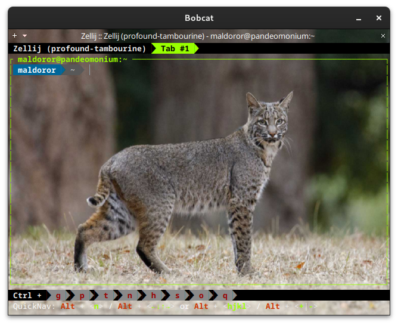
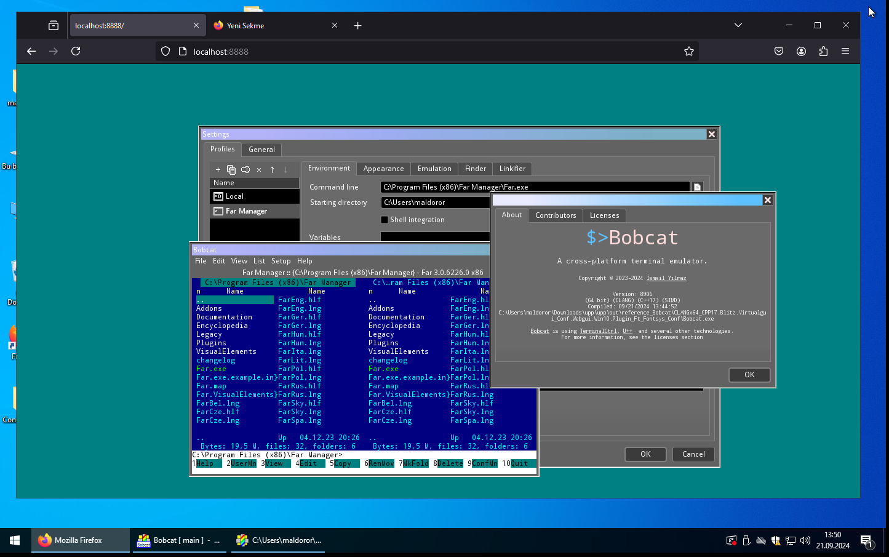
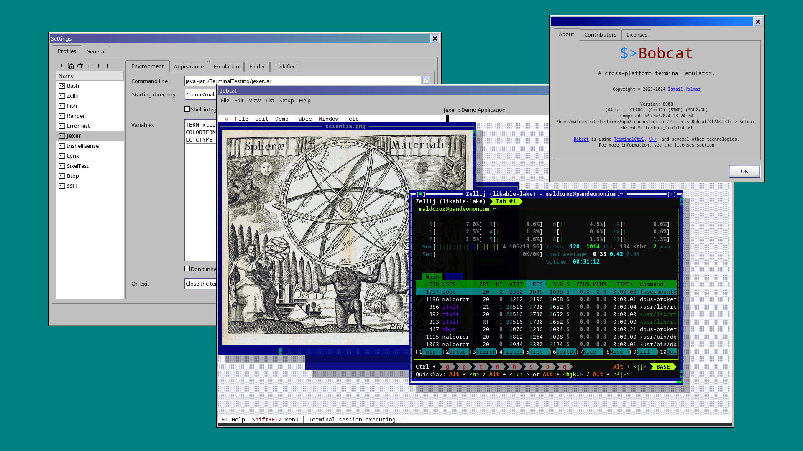
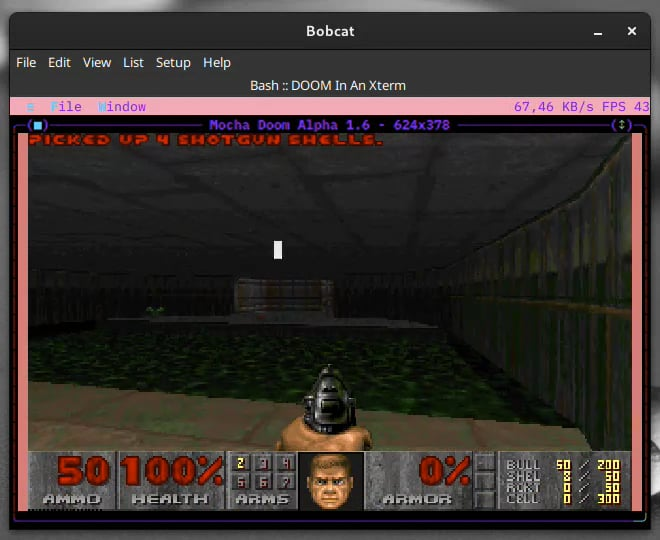

# Bobcat - Terminal Emulator

Bobcat is a cross-platform terminal emulator built on the [U++](https://www.ultimatepp.org/index.html) rapid application development framework and [TerminalCtrl](https://github.com/ismail-yilmaz/Terminal), a powerful vt widget. It leverages these technologies to provide a versatile and user-friendly command-line interface.

*Disclaimer: Bobcat is a work in progress. Although it *should be* pretty stable by now, use it with caution.*

## Table of Contents

 1. [Features](#Features)
 2. [Requirements](#Requirements)
 3. [Installation](#Installation)
 4. [To Do](#ToDo)
 5. [Screenshots](#Screenshots)
 6. [Videos](#Videos)
 7. [Acknowledgements](#Acknowledgements)
 8. [License](#License)

## [Features](#Features)

*For a full range of supported VT features, see the [Features](https://github.com/ismail-yilmaz/Terminal#features) section of TerminalCtrl's docs.*

*For a full range of supported VT sequences, modes and control commands, see the [technical specifications document](https://github.com/ismail-yilmaz/Terminal/blob/master/Terminal/Specs.md) of TerminalCtrl.*

- **Cross-Platform Compatibility:** Bobcat runs seamlessly on any operating system that supports **U++ compilation**, including **Linux**, **Windows**, **MacOS**, and **BSD**.  

- **High Compatibility:** Recognizes and supports a wide range of terminal sequences (ESC, CSI, DCS, OSC, APC), ensuring **VT (DEC/ANSI)** and **xterm** compatibility. By default, Bobcat emulates a **DEC VT420** terminal with various extensions, providing reliable performance across diverse environments.  

- **Image Support:** Displays images inline with support for both legacy (**Sixel**) and modern formats (**PNG, JPG, BMP, TIFF**). Compatible with sixel, iTerm2, and Jexer protocols for maximum versatility.  

- **OSC Extensions:** Implements advanced **OSC (Operating System Command)** extensions, including **hyperlinks**, **clipboard manipulation**, and more, bringing modern functionality to your terminal.  

- **Annotations:** Supports **plain** and **rich text annotations**, which can be added programmatically or via user input, enhancing workflow documentation.  

- **Versatile Copy/Paste:** Facilitates **copy, paste, and drag-and-drop** operations for text, links, and even inline images, making interaction seamless and intuitive.  

- **Multiple Profiles:** Allows users to create and manage **multiple terminal and color profiles**, adapting to varied tasks and environments effortlessly.  

- **Configurable UI:** Customize Bobcat’s interface to suit your needs—opt for a minimal bare-bones terminal or a **fully-featured GUI**.  

- **Stacked Interface:** Reduces UI clutter with a **stacked interface**, including a **Navigator** terminal manager for easy navigation between open terminals.  

- **Simple Configuration:** Uses a straightforward **JSON format** for configuration files, ensuring quick setup and easy management.  

- **Multiple Pty Support on Windows:** Supports **ConPty** and **WinPty** backends on Windows, with a runtime switch for flexibility. The **WinPty backend** is statically linked, eliminating the need for external environments like **msys2** or **cygwin**, while remaining compatible with them if desired.  

- **Mouse Events:** Fully supports mouse events across nearly all protocols, enhancing interactivity and enabling seamless navigation.

- **Configurable Keys:** Allows users to define custom keyboard shortcuts, providing a personalized and efficient terminal experience.

- **Emoji Support:** Displays color emojis, bringing modern visual expression to your terminal (font-dependent).

- **Colorful Experience:** Supports 16, 256, and 24-bit colors, along with xterm's dynamic color features. Additionally, Bobcat recognizes advanced color specifications like CMY and CMYK, offering a vivid and versatile visual environment.

- **Powerful Search Engine:** Bobcat features a robust and versatile search and highlight engine called **Finder**, designed to streamline text navigation and data extraction. Finder supports both **case-sensitive** and **case-insensitive** searches, as well as **regular expression (regexp)** based queries, operating seamlessly across the visible page and the scrollback buffer. Users can easily navigate through the found strings in either direction, ensuring swift and precise access to relevant information. But that’s not all—Finder includes a powerful **Harvester** mode. This functionality allows users to extract (or "reap") matched text when using regexp search, exporting the results into a **CSV file** for further analysis or use. For instance, if you need to find URL patterns in the terminal’s buffer, simply provide your regexp pattern to Finder, and it will harvest and export the matched URLs effortlessly. Finder also offers an advanced feature to **maintain horizontal order** during harvesting. This means the extracted strings are "mapped" exactly as they appear in the original context, preserving their positional integrity. This capability is especially useful for extracting structured data, such as tables or outputs with consistent line patterns.

- **Linkify Anything: Bobcat Linkifier**: Bobcat includes a powerful feature called **Linkifier**, which allows you to transform any text into clickable hyperlinks using customizable **regular expression (regexp)** patterns. With this module, you can dynamically linkify specific text, making it interactive and more functional. Each terminal profile in Bobcat can have its own **unique Linkifier configuration**, enabling tailored setups for different workflows or contexts. Moreover, a single profile can be configured to scan for **multiple patterns** simultaneously, offering unparalleled flexibility and efficiency in managing links. Whether you’re working with log files, code outputs, or other textual data, Linkifier ensures that relevant information becomes instantly accessible with a simple click, streamlining navigation and productivity.

- **Smart Text Selection: Customizable Patterns**: Bobcat empowers users with **Smart Text Selection**, allowing complete control over how text is selected. Users can define their own **custom selection patterns** to match specific words, phrases, or structures using **regular expressions**. This feature is fully **profile-specific**, enabling different terminal profiles to have tailored selection rules for various tasks or environments. Additionally, Bobcat supports defining **multiple patterns simultaneously**, ensuring seamless adaptability to diverse text formats or workflows. With Smart Text Selection, navigating and highlighting the exact text you need becomes faster, smarter, and perfectly suited to your unique requirements.

- **Web Support: Access Anywhere**: Bobcat offers **experimental web support**, enabling it to run on any modern web browser with **HTML5** and **Canvas** support. Deploy Bobcat on your server, and you can access it remotely from anywhere—no local installation required.  

- **Headless UI Support:** Bobcat also features **experimental Headless UI support**, allowing it to be compiled to run on an **SDL2-GL backend**. This eliminates the need for a full desktop environment, making it an excellent choice for minimal setups or resource-constrained systems.  

**Note:** Both features are experimental, so try them out and explore their potential!

- **Can run doom!**

## [Requirements](#Requirements)

Requirements are not heavy.  Below are the tools you need to compile Bobcat.

- CLANG/GCC with at least C++17.
- [U++](https://www.ultimatepp.org) framework.
- [TerminalCtrl](https://github.com/ismail-yilmaz/Terminal)
- [StackCtrl](https://github.com/ismail-yilmaz/StackCtrl)
- [MessageCtrl](https://github.com/ismail-yilmaz/MessageCtrl)  

## [Installation](#Installation)

There are three ways to install the source code of Bobcat:

1.  The package is immediately available via [UppHub](https://www.ultimatepp.org/app$ide$UppHub_en-us.html), the 3rd-party source package management system of U++. This is the simplest and recommended method. But in order to use UppHub you will need TheIDE, the integrated development environment for U++. TheIDE is available in binary or in source form. On windows it comes bundled with the U++ installer. On Linux it can be easily downloaded via [flathub](https://flathub.org/apps/org.ultimatepp.TheIDE), or built manually, as it is a part of the upp's source code. 

2. On linux, the provided makefile can also be used to compile Bobcat. This makefile downloads umk (U++ make) *in binary form* to speed up the compilation process. Steps to download, build and run the Bobcat via this method are:

	1. `make download`
	2. `make build` or `make build-web` or `make build-headless`
	3. `make run`

3.  Or you can manually clone or download this repository and set it up as an U++ _assembly_ or _nest_. You can find more information on U++ packages, assemblies and nests, [here](https://www.ultimatepp.org/app$ide$PackagesAssembliesAndNests$en-us.html).

## [To Do](#ToDo)

- Macro infrastructure, based on Upp::Esc scripting language.
- A "lite" plugin framework.

## [Screenshots](#Screenshots)

Below you can find a handful of screenshots of Bobcat, running on Linux & Windows.

Bobcat on Linux 

Bobcat on Windows

Bobcat, running zellij, with a background image of well..., a bobcat!

Multiple terminal profile support (linux, btop)

Inline images support (linux, jexer)

Navigator (linux)

Finder, in regex-based search mode (linux)

Harvester, harvesting 124660 URLs from the buffer, and mapping them into a csv file (linux)

Settings windows (linux)

Far manager running on Bobcat (Windows 10)

Bobcat deployed as a simple web server with access from web browsers (Linux)

Bobcat deployed as a simple web server with access from web browsers (Windows)

Bobcat running "headless" on SDL2 (GL) backend (Linux)

Doom, running on Bobcat, via [mochadoom](https://github.com/AutumnMeowMeow/mochadoom) (Linux)

## [Videos](#Videos)

A very short [demonstration](https://vimeo.com/999236026) of Bobcat, running DOOM!

A very short [demonstration](https://vimeo.com/1003353669?share=copy) of finder/harvester and unicode character (emoji) input.

## [Acknowledgements](#Acknowledgements)

To be written...

## [License](#License)

Copyright (c) 2023-2025, İsmail Yılmaz

Bobcat is free software: you can redistribute it and/or modify it under the terms of the GNU General Public License as published by the Free Software Foundation, either version 3 of the License, or (at your option) any later version.

Bobcat is distributed in the hope that it will be useful, but WITHOUT ANY WARRANTY; without even the implied warranty of MERCHANTABILITY or FITNESS FOR A PARTICULAR PURPOSE. See the GNU General Public License for details. You should have received a copy of the GNU General Public License along with Bobcat. If not, see [gnu licenses](http://www.gnu.org/licenses/)

