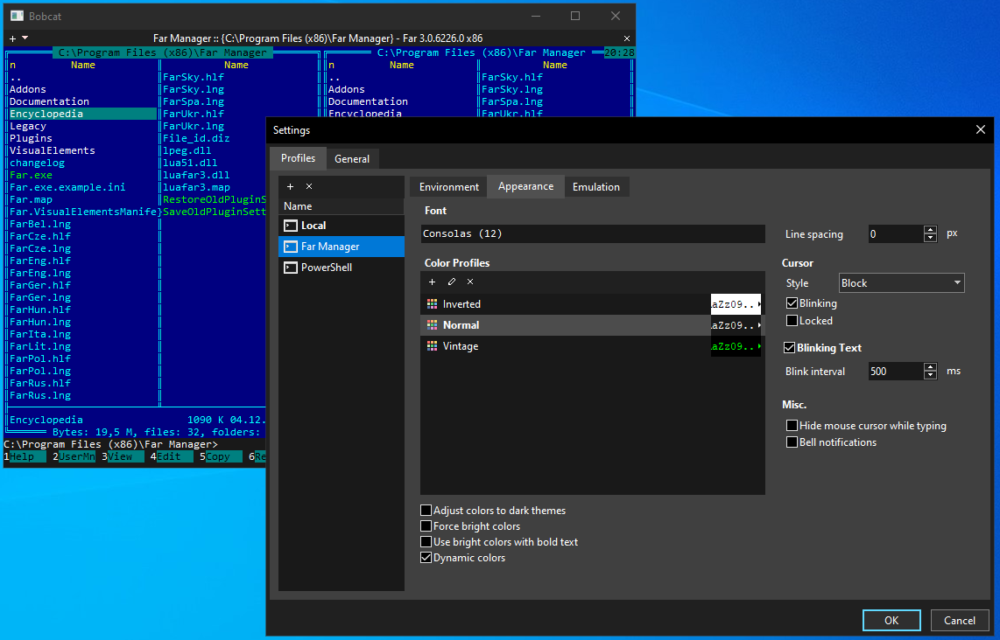

# Bobcat - Terminal Emulator

Bobcat is a cross-platform terminal emulator built on the [U++](https://www.ultimatepp.org/index.html) rapid application development framework and [TerminalCtrl](https://github.com/ismail-yilmaz/Terminal), a powerful vt widget. It leverages these technologies to provide a versatile and user-friendly command-line interface.

*Disclaimer: Bobcat is a work in progress. Although it *should be* pretty stable by now, use it with caution.*

## Table of Contents

 1. [Features](#Features)
 2. [Requirements](#Requirements)
 3. [Installation](#Installation)
 4. [To Do](#ToDo)
 5. [Screenshots](#Screenshots)
 6. [Acknowledgements](#Acknowledgements)
 7. [License](#License)

## [Features](#Features)

*For a full range of supported VT features, see the [Features](https://github.com/ismail-yilmaz/Terminal#features) section of TerminalCtrl's docs.*

*For a full range of supported VT sequences, modes and control commands, see the [technical specifications document](https://github.com/ismail-yilmaz/Terminal/blob/master/Terminal/Specs.md) of TerminalCtrl.*

- **Cross-Platform:** Bobcat can basically run on any OS that U++ can be compiled on: Linux, Windows, MacOS, and BSD.
- **High Compatibility:** Recognizes and supports a wide range of terminal sequences (ESC, CSI, DCS, OSC, APC) sequences, ensuring high VT (DEC/ANSI) and xterm compatibility. (By default Bobcat emulates a DEC VT420 with various extensions)
- **Image Support:** Supports both legacy (sixel) and modern image formats (png, jpg, bmp, tiff) for inline image display, and recognizes sixel, iterm2 & jexer protocols.
- **OSC Extensions:** Implements newer OSC extensions, including hyperlinks, clipboard manipulation protocol, etc.
- **Versatile Copy/Paste:** Supports copy/paste/drag-and-drop operations on texts, links, and inline-images.
- **Multiple Profiles:** Supports multiple terminal and color profiles.
- **Configurable UI:** Offers a configurable user interface, allowing for a bare-bone terminal or fully-fledged GUI.
- **Stacked Interface:** Uses a stacked interface to reduce UI clutter, including a terminal manager called Navigator to navigate between open/stacked terminals.
- **Simple Configuration:** Uses a simple JSON format for configuration files.
- **Multiple Pty Support on Windows:** Can use ConPty or WinPty (compile-time feature, with plans to make it runtime) on Windows. WinPty backend is statically linked and *does not* require msys2 or cygwin environments but can be also used with them.
- **Mouse Events:** Supports mouse events for almost all protocols.
- **Configurable Keys:** Supports configurable keyboard shortcuts for a personalized experience.
- **Emoji Support:** Can display color emojis (depending on the font).
- **Colorful Experience:** Supports 16, 256, and 24-Bit colors, xterm's dynamic colors feature, and even recognizes CMY and CMYK color spec formats.
- **Performance:** Reasonably fast and less memory-hungry.

## [Requirements](#Requirements)

Requirements are not heavy.  Below are the tools you need to compile Bobcat.

- CLANG/GCC with at least C++17.
- [U++](https://www.ultimatepp.org) framework.
- [TerminalCtrl](https://github.com/ismail-yilmaz/Terminal)
- [StackCtrl](https://github.com/ismail-yilmaz/StackCtrl)  

## [Installation](#Installation)

There are three ways to install the source code of Bobcat:

1.  The package is immediately available via [UppHub](https://www.ultimatepp.org/app$ide$UppHub_en-us.html), the 3rd-party source package management system of U++. This is the simplest and recommended method. But in order to use UppHub you will need TheIDE, the integrated development environment for U++. TheIDE is available in binary or in source form. On windows it comes bundled with the U++ installer. On Linux it can be easily downloaded via [flathub](https://flathub.org/apps/org.ultimatepp.TheIDE), or built manually, as it is a part of the upp's source code. 

2. On linux, the provided makefile can also be used to compile Bobcat. This makefile downloads umk (U++ make) *in binary form* to speed up the compilation process. Steps to download, build and run the Bobcat via this method are:

	1. `make download`
	2. `make build`
	3. `make run`

3.  Or you can manually clone or download this repository and set it up as an U++ _assembly_ or _nest_. You can find more information on U++ packages, assemblies and nests, [here](https://www.ultimatepp.org/app$ide$PackagesAssembliesAndNests$en-us.html).

## [To Do](#ToDo)

- Macro infrastructure, based on Upp::Esc scripting language.
- A "lite" plugin framework.

## [Screenshots](#Screenshots)

Below you can find a handful of screenshots of Bobcat, running on Linux & Windows.

Bobcat on Linux 

Bobcat on Windows

Multiple terminal profile support (linux, btop)

Inline images support (linux, jexer)

Navigator (linux)

Finder, in regex-based search mode (linux)

Settings windows (linux)

Far manager running on Bobcat (Windows 10)

## [Acknowledgements](#Acknowledgements)

To be written...

## [License](#License)

Copyright (c) 2023-2024, İsmail Yılmaz

Bobcat is free software: you can redistribute it and/or modify it under the terms of the GNU General Public License as published by the Free Software Foundation, either version 3 of the License, or (at your option) any later version.

Bobcat is distributed in the hope that it will be useful, but WITHOUT ANY WARRANTY; without even the implied warranty of MERCHANTABILITY or FITNESS FOR A PARTICULAR PURPOSE. See the GNU General Public License for details. You should have received a copy of the GNU General Public License along with Bobcat. If not, see [gnu licenses](http://www.gnu.org/licenses/)

